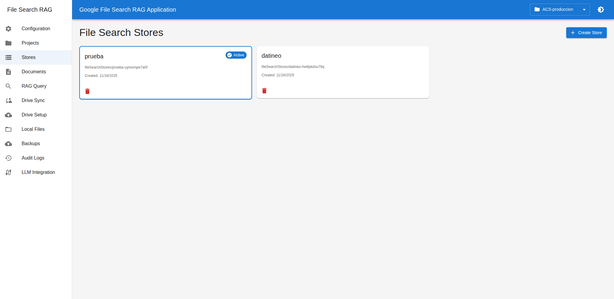
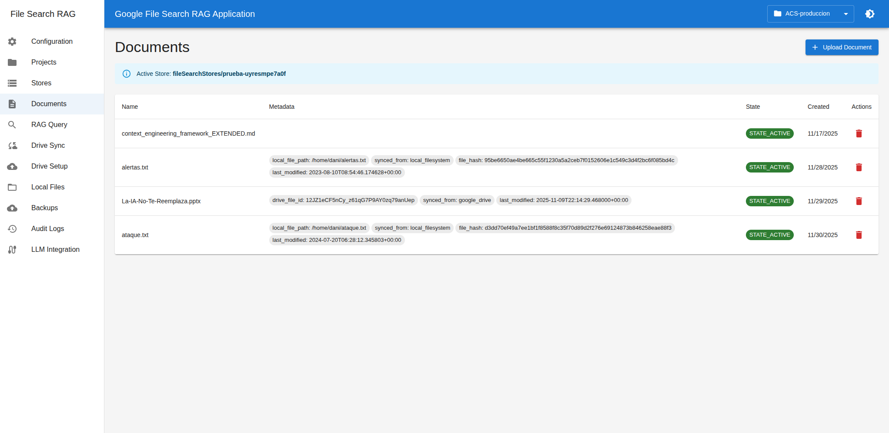
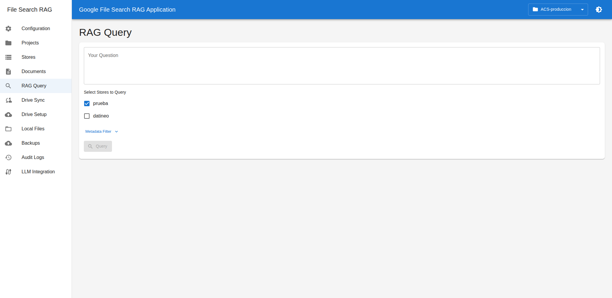
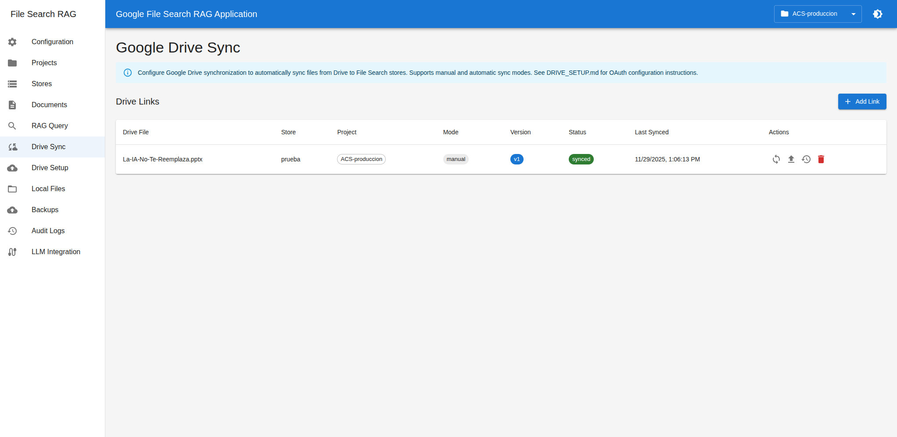
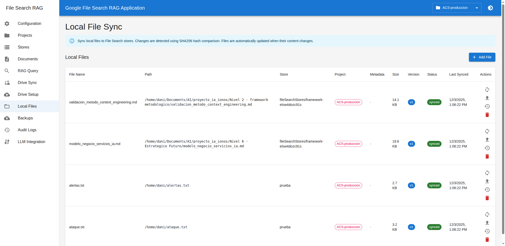
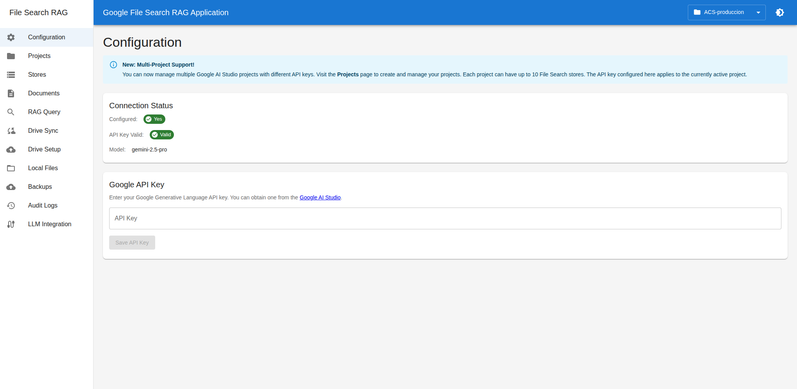

# File Search RAG Application

A full-stack web application for managing Google File Search and executing RAG (Retrieval-Augmented Generation) queries with a modern interface, REST API, and **full Google Drive synchronization support**.

## Screenshots

| Stores | Documents | RAG Query |
|--------|-----------|-----------|
|  |  |  |

| Drive Sync | Local Files | Configuration |
|------------|-------------|---------------|
|  |  |  |

## Key Features

- **RAG Queries** - Natural language search with source citations
- **Store Management** - Create and manage File Search stores
- **Document Management** - Upload with custom metadata, duplicate detection (SHA256)
- **Google Drive Sync** - Auto-sync files from Drive with Picker UI
- **Local File Sync** - Monitor and sync local files automatically
- **REST API** - Full API with Swagger documentation
- **MCP Server** - 21 tools for LLM agents (Claude Code, Gemini CLI, Codex)
- **Multi-Project** - Manage multiple Google AI Studio projects

## Important - Version 2.0

This application uses the **official `google-genai` SDK** (v1.6.1+). The older `google-generativeai` SDK **does NOT support File Search** and will cause errors.

**If you get the error**: `module 'google.generativeai' has no attribute 'list_file_search_stores'`
- **Solution**: Install the correct dependencies: `pip install -r requirements.txt`
- The correct SDK is `google-genai` (not `google-generativeai`)

**What's New in v2.2**:
- **Multi-Project Support**: Manage multiple Google AI Studio projects with different API keys
- **Complete MCP Server**: 21 tools for Gemini CLI, Claude Code, and Codex CLI
- **Local CLI**: Command-line interface with Rich for terminal and agents
- **Web-based MCP/CLI Management**: Configuration from the web interface
- See [CHANGELOG.md](CHANGELOG.md) for full details on v2.2, v2.1, and v2.0
- See [MCP_INTEGRATION.md](MCP_INTEGRATION.md) for LLM agent integration
- See [MULTI_PROJECT.md](MULTI_PROJECT.md) for multi-project management
- See [DRIVE_SETUP.md](DRIVE_SETUP.md) for Google Drive setup

## Features

### Implemented Functionality

- **Configuration Management**
  - Google API key configuration
  - Real-time connection validation
  - Secure backend storage

- **File Search Store Management**
  - Create, list, and delete stores
  - Active store selection
  - Metadata visualization

- **Document Management**
  - Upload documents to File Search store
  - **Duplicate Detection via SHA256**: Automatically prevents duplicate uploads
  - **Duplicate Warning**: Interactive dialog with option to force upload
  - **Complete Tracking**: All documents registered in DB with hash, metadata, and date
  - Paginated document listing
  - Document updates (delete + recreate)
  - Document deletion with force option (for indexed documents)
  - Original filename preservation
  - **Full support for custom metadata** (text and numeric)

- **RAG Queries**
  - Natural language questions
  - Multi-store search
  - Custom metadata filters
  - Response visualization with citations to source documents
  - Grounding metadata extraction

- **User Interface**
  - Modern UI with Material-UI
  - Light and dark themes
  - Responsive navigation
  - Clear state and error visualization

- **Complete REST API**
  - Endpoints documented with FastAPI (Swagger/OpenAPI)
  - CORS configured for local development
  - Robust error handling
  - Support for multipart/form-data

- **MCP Integration (Model Context Protocol)**
  - Complete MCP server with 21 tools
  - Compatible with Gemini CLI, Claude Code, and Codex CLI
  - Support for stdio and HTTP
  - Complete integration documentation

- **Local CLI (filesearch-gemini)**
  - Complete command-line interface
  - Subcommands for all operations
  - Compatible with LLM agents
  - Formatted output with Rich

- **Multi-Project Support**
  - Manage multiple Google AI Studio projects
  - Each project with its own API key
  - Up to 10 stores per project
  - Project selector in the header
  - Quick switching between projects
  - See [MULTI_PROJECT.md](MULTI_PROJECT.md) for more details

- **Local File Synchronization**
  - Link server local files to File Search stores
  - **Custom Metadata**: Add up to 20 key-value pairs to each file
  - **Project Association**: Files automatically linked to the active project
  - **Automatic Filtering**: Only files from the active project are displayed
  - **Change Detection**: Automatic synchronization based on SHA256 hash
  - **Auto-sync Scheduler**: Automatic synchronization every 3 minutes
  - **File Versioning**: Complete update history
  - **Auto-reload**: List updates when switching projects

- **Google Drive Synchronization**
  - Data models prepared with SQLite persistence
  - Endpoints implemented for link management
  - **Google Picker API**: Visually select Drive files from the UI (100% functional)
  - Integrated file browser in creation dialog with "Browse Drive" button
  - Auto-fill of File ID and filename when selecting
  - Complete UI for configuring Drive → File Search links
  - Structure for manual/automatic synchronization
  - See [GOOGLE_PICKER_SETUP.md](GOOGLE_PICKER_SETUP.md) for configuration

- **Server File Browser**
  - Explore server local files from the UI
  - Direct file selection for upload
  - Secure navigation with directory restrictions

## Architecture

### Backend (Python + FastAPI)

```
backend/
├── app/
│   ├── main.py              # Main FastAPI application
│   ├── config.py            # Global configuration
│   ├── database.py          # SQLAlchemy setup
│   ├── models/              # Pydantic and DB models
│   │   ├── db_models.py     # SQLAlchemy models (ProjectDB, DocumentDB, DriveLinkDB, LocalFileLinkDB)
│   │   ├── store.py
│   │   ├── document.py
│   │   ├── query.py
│   │   ├── config.py
│   │   ├── drive.py
│   │   ├── project.py       # Multi-project models
│   │   └── mcp_config.py    # MCP/CLI config models
│   ├── services/            # Business logic
│   │   ├── google_client.py
│   │   ├── store_service.py
│   │   ├── document_service.py
│   │   ├── query_service.py
│   │   ├── drive_service.py
│   │   ├── project_service.py      # Project management
│   │   └── mcp_config_service.py   # MCP/CLI config management
│   ├── api/                 # REST endpoints
│   │   ├── config.py
│   │   ├── stores.py
│   │   ├── documents.py
│   │   ├── query.py
│   │   ├── drive.py
│   │   ├── projects.py      # Multi-project endpoints
│   │   └── mcp_config.py    # MCP/CLI config endpoints
│   └── mcp/                 # MCP server
│       └── server.py        # 21 MCP tools
├── mcp_server.py            # MCP server entry point
├── requirements.txt
└── filesearch.db            # SQLite database
```

### Frontend (React + TypeScript + Vite)

```
frontend/
├── src/
│   ├── components/          # React components
│   │   ├── common/          # Layout, navigation, ProjectSelector
│   │   ├── config/          # Configuration
│   │   ├── projects/        # Multi-project management
│   │   ├── stores/          # Store management
│   │   ├── documents/       # Document management
│   │   ├── query/           # RAG queries
│   │   ├── drive/           # Drive synchronization
│   │   └── integration/     # MCP Server & CLI Config
│   ├── services/            # API client
│   │   └── api.ts           # Includes projectsApi, mcpApi, cliApi
│   ├── types/               # TypeScript types
│   │   └── index.ts         # Includes Project, MCP, CLI types
│   ├── theme/               # MUI themes
│   │   └── theme.ts
│   ├── App.tsx
│   └── main.tsx
└── package.json
```

## Installation and Setup

### Prerequisites

- **Python 3.11+**
- **Node.js 18+** and **npm**
- **Google API Key** for Generative Language API ([Get it here](https://aistudio.google.com/app/apikey))

### 1. Clone the Repository

```bash
git clone <repository-url>
cd filesearch-gemini
```

### 2. Configure the Backend

```bash
cd backend

# Create virtual environment
python -m venv venv

# Activate virtual environment
# On Linux/Mac:
source venv/bin/activate
# On Windows:
# venv\Scripts\activate

# Install dependencies
pip install -r requirements.txt

# Create .env file (optional, can also be configured from the UI)
cp .env.example .env
# Edit .env and add your GOOGLE_API_KEY if desired
```

### 3. Configure the Frontend

```bash
cd ../frontend

# Install dependencies
npm install

# Create .env file (optional)
cp .env.example .env
```

### 4. Start the Application

#### Option A: Use two terminals

**Terminal 1 - Backend:**
```bash
cd backend
source venv/bin/activate  # or venv\Scripts\activate on Windows
python -m uvicorn app.main:app --reload --host 0.0.0.0 --port 8000
```

The backend will be available at: `http://localhost:8000`
API Documentation: `http://localhost:8000/docs`

**Terminal 2 - Frontend:**
```bash
cd frontend
npm run dev
```

The frontend will be available at: `http://localhost:5173`

#### Option B: Startup script (create a bash script)

```bash
#!/bin/bash
# start.sh

# Start backend in background
cd backend
source venv/bin/activate
python -m app.main &
BACKEND_PID=$!

# Start frontend
cd ../frontend
npm run dev

# Cleanup on exit
kill $BACKEND_PID
```

## LLM Agent Integration (MCP and CLI)

This application can now be used from **LLM agents** like **Gemini CLI**, **Claude Code**, and **Codex CLI** through two methods:

### Method 1: MCP Server (Recommended)

The MCP server exposes all File Search operations as tools that agents can invoke:

```bash
# Start the MCP server
cd backend
python mcp_server.py
```

**Available MCP tools (21 total)**:
- Configuration: `set_api_key`, `get_config_status`
- Stores: `create_store`, `list_stores`, `get_store`, `delete_store`
- Documents: `upload_document`, `list_documents`, `update_document`, `delete_document`
- RAG Queries: `rag_query`
- Drive Sync: `create_drive_link`, `list_drive_links`, `sync_drive_link_now`, etc.

### Method 2: Local CLI

You can also use the CLI directly from your terminal or from LLM agents:

```bash
# View help
./filesearch-gemini --help

# Quick examples
./filesearch-gemini stores list
./filesearch-gemini docs upload --store-id xxx --file doc.pdf
./filesearch-gemini query --question "What does it say about X?" --stores xxx
```

### Web Interface Management

The new **LLM Integration** section in the web interface allows you to:

- **Configure the MCP server**: Backend URL, enable/disable
- **View configuration examples** for Gemini CLI, Claude Code, and Codex with copy/paste buttons
- **Configure the local CLI**: Backend URL, default store
- **Access the complete guide** for integration with step-by-step instructions

Access at: **http://localhost:5173/integration** after starting the frontend.

### Agent Configuration

#### Gemini CLI

Add to your `settings.json`:

```json
{
  "mcpServers": {
    "filesearch-gemini": {
      "type": "stdio",
      "command": "python",
      "args": ["/path/to/filesearch-gemini/backend/mcp_server.py"]
    }
  }
}
```

#### Claude Code

```bash
claude mcp add filesearch-gemini \
  --transport stdio \
  --command "python" \
  --args "backend/mcp_server.py"
```

#### Codex CLI

```bash
codex mcp-server add filesearch-gemini \
  --command "python" \
  --args "/path/to/filesearch-gemini/backend/mcp_server.py"
```

**Complete documentation**: See [MCP_INTEGRATION.md](./MCP_INTEGRATION.md) for detailed instructions, usage examples, and troubleshooting.

---

## Application Usage

The application can be used in **4 different ways**:

1. **Web Interface** (browser at http://localhost:5173)
2. **REST API** (HTTP requests to http://localhost:8000)
3. **MCP Server** (for LLM agents)
4. **Local CLI** (`filesearch-gemini` command)

### Initial Setup (First Use)

#### Option 1: Create a Project (Recommended - Multi-Project)

1. **Navigate to the Projects section** at `http://localhost:5173/projects`
2. **Click "Create Project"**
3. **Fill in the form:**
   - **Name**: For example "My Main Project"
   - **API Key**: Your Google AI Studio API key ([Get it here](https://aistudio.google.com/app/apikey))
   - **Description** (optional): Project description
4. **Click "Create"**
5. The project will be automatically activated and appear in the header selector
6. **Restart the backend** to load the active project

#### Option 2: Configure API Key Directly (Without Multi-Project)

1. **Navigate to the Configuration section**
2. **Enter your Google API Key**
3. **Click "Save API Key"**
4. Verify that the status shows "API Key Valid: Valid"

**Note**: With option 2, you can only use one project. Option 1 allows you to manage multiple Google AI Studio projects.

### Using the Web Interface

### 2. Create a Store

1. Go to the **Stores** section
2. Click **Create Store**
3. Enter a descriptive name
4. The store will be automatically marked as active

### 3. Upload Documents

1. Go to the **Documents** section
2. Click **Upload Document**
3. Select a file
4. Click **Upload**
5. The document will be automatically indexed in the File Search store with the provided metadata

### 4. Perform RAG Queries

1. Go to the **RAG Query** section
2. Select one or more stores
3. Write your question
4. (Optional) Add a metadata filter: `author="Robert Graves"`
5. Click **Query**
6. Review the response and cited sources

### 5. Configure Drive Synchronization (Future Base)

1. Go to the **Drive Sync** section
2. Click **Add Link**
3. Enter the Google Drive file ID
4. Select the destination store
5. Choose manual or automatic mode
6. Full functionality will be implemented in future versions

## REST API

The API is fully documented with Swagger/OpenAPI. Access at:
- **Interactive Documentation**: `http://localhost:8000/docs`
- **ReDoc**: `http://localhost:8000/redoc`

### Main Endpoints

#### Configuration
- `POST /config/api-key` - Configure API key
- `GET /config/status` - Get configuration status

#### Stores
- `POST /stores` - Create store
- `GET /stores` - List stores
- `GET /stores/{store_id}` - Get store
- `DELETE /stores/{store_id}` - Delete store

#### Documents
- `POST /stores/{store_id}/documents` - Upload document
- `GET /stores/{store_id}/documents` - List documents
- `PUT /stores/{store_id}/documents/{document_id}` - Update document
- `DELETE /stores/{store_id}/documents/{document_id}` - Delete document

#### RAG Queries
- `POST /query` - Execute RAG query

#### Drive Links
- `POST /drive-links` - Create Drive link
- `GET /drive-links` - List links
- `GET /drive-links/{link_id}` - Get link
- `DELETE /drive-links/{link_id}` - Delete link
- `POST /drive-links/{link_id}/sync-now` - Sync (stub)

#### Projects (Multi-Project)
- `POST /projects` - Create project
- `GET /projects` - List projects + active project
- `GET /projects/active` - Get active project
- `GET /projects/{id}` - Get specific project
- `PUT /projects/{id}` - Update project
- `POST /projects/{id}/activate` - Activate project
- `DELETE /projects/{id}` - Delete project

#### MCP/CLI Integration
- `GET /integration/mcp/config` - Get MCP configuration
- `POST /integration/mcp/config` - Update MCP configuration
- `GET /integration/mcp/status` - MCP status and examples
- `GET /integration/cli/config` - Get CLI configuration
- `POST /integration/cli/config` - Update CLI configuration
- `GET /integration/cli/status` - CLI status and examples
- `GET /integration/guide` - Complete integration guide

### Usage Example with cURL

```bash
# Configure API key
curl -X POST http://localhost:8000/config/api-key \
  -H "Content-Type: application/json" \
  -d '{"api_key": "your_api_key_here"}'

# Create a store
curl -X POST http://localhost:8000/stores \
  -H "Content-Type: application/json" \
  -d '{"display_name": "My Documents"}'

# Upload a document
curl -X POST http://localhost:8000/stores/{store_id}/documents \
  -F "file=@/path/to/document.pdf" \
  -F "display_name=Important Document" \
  -F 'metadata={"author":"John Doe","year":2024}'

# Execute RAG query
curl -X POST http://localhost:8000/query \
  -H "Content-Type: application/json" \
  -d '{
    "question": "What is the main topic?",
    "store_ids": ["fileSearchStores/abc123"],
    "metadata_filter": "author=\"John Doe\""
  }'
```

## UI Features

- **Themes**: Toggle between light and dark mode using the button in the upper right corner
- **Navigation**: Side menu with access to all sections
- **Responsive**: Adapts to different screen sizes
- **Visual Feedback**: Loading states, error and success messages
- **Validation**: Real-time form validation

## Ports and Services

The application uses the following default ports:

- **Frontend**: `http://localhost:5173` (Vite dev server)
- **Backend FastAPI**: `http://localhost:8000` (uvicorn)
- **MCP Server**: Configurable from the GUI (recommended: port 8001)
- **Local CLI**: Connects to backend (configurable port from GUI)

**Important**:
- The **CLI** and **MCP Server** are NOT standalone servers
- The **CLI** is a command-line tool that connects to the FastAPI backend
- The **MCP Server** can run in stdio mode (no port) or HTTP (configurable port)

## Security

- API keys are stored in the SQLite database (backend/filesearch.db)
- They can also be configured in the `backend/.env` file for backward compatibility
- API keys are not exposed in API responses (`has_api_key` field)
- CORS configured only for local origins
- For production, consider:
  - **Encrypting API keys** in the database (TODO marked in code)
  - Adding authentication (JWT, OAuth)
  - Using HTTPS
  - Configuring CORS appropriately
  - Using secure environment variables
  - Implementing rate limiting

## Development

### Code Structure

- **Backend**: Layered architecture (API → Services → Google Client)
- **Frontend**: Functional components with React Hooks
- **MCP Server**: FastMCP for exposing tools to LLM agents
- **CLI**: Click + Rich for command-line interface
- **Typing**: Strict TypeScript in frontend, Pydantic in backend
- **State**: React Query for server data, useState for local UI

### Logging

The backend logs all important operations:
- Google connections
- Store creation/deletion
- Document uploads
- RAG queries

Logs appear in the backend server console.

### Error Handling

- API errors captured and displayed in the UI
- HTTP responses with appropriate status codes
- Descriptive error messages

## Known Limitations

1. **Drive Synchronization**: Implemented as stub, requires:
   - OAuth 2.0 authentication
   - Google Drive API integration
   - Scheduler for automatic synchronization

2. **Pagination**: Implemented in backend, basic UI in frontend

3. **Drive Links Persistence**: Implemented with SQLite (backend/filesearch.db)

## Future Improvements

### High Priority
- [x] **COMPLETED**: Implement custom metadata upload for documents
- [x] **COMPLETED**: Server file browser

### Other Improvements
- [ ] Complete Google Drive synchronization implementation
- [ ] Database for Drive link persistence
- [ ] User authentication and authorization
- [ ] Per-user permission management
- [ ] Query and response export
- [ ] Query history
- [ ] Usage analytics and statistics
- [ ] Support for more document formats
- [ ] Advanced document search and filtering in UI
- [ ] Unit and integration tests
- [x] **COMPLETED**: MCP server for LLM agent integration
- [x] **COMPLETED**: Local CLI for terminal and agent use

## Reference Documentation

- [Google File Search Documentation](https://ai.google.dev/gemini-api/docs/file-search)
- [Google Generative AI Python SDK](https://github.com/google/generative-ai-python)
- [FastAPI Documentation](https://fastapi.tiangolo.com/)
- [Material-UI Documentation](https://mui.com/)
- [React Router](https://reactrouter.com/)

## Backup & Restore

The project includes a `manage_backup.sh` script to facilitate backing up and restoring the database and local credentials.

### Create a Backup

```bash
./manage_backup.sh backup
```

This will create a `.tar.gz` file in the `backups/` folder containing:
- `backend/app.db` (Database)
- `backend/token.json` (Google Drive session)
- `backend/credentials.json` (OAuth credentials)

### Restore a Backup

```bash
./manage_backup.sh restore backups/backup_filesearch_YYYYMMDD_HHMMSS.tar.gz
```

**Warning**: When restoring, current data in `backend/` will be overwritten. The script will ask for confirmation before proceeding.

### Web Interface Management (New)

You can also conveniently manage your backups from the web application:

1. Go to the **Backups** section in the side menu.
2. **Create Backup**: Click the "Create Backup" button.
3. **Restore**: Click the restore icon (clock) next to any backup.
4. **Download**: Download `.tar.gz` files to your computer.
5. **Upload and Restore**: Upload a previous backup file and restore it in one step.

## Troubleshooting

### Backend won't start

```bash
# Verify that the virtual environment is activated
source venv/bin/activate  # Linux/Mac
# or
venv\Scripts\activate  # Windows

# Verify dependency installation
pip install -r requirements.txt
```

### Frontend won't start

```bash
# Reinstall dependencies
rm -rf node_modules package-lock.json
npm install
```

### Error "API key not configured"

1. Configure the API key from the UI (Configuration section)
2. Or edit the `backend/.env` file and add:
   ```
   GOOGLE_API_KEY=your_api_key_here
   ```

### CORS Error

Verify that:
- The backend is at `http://localhost:8000`
- The frontend is at `http://localhost:5173`
- Origins are configured in `backend/.env`:
  ```
  CORS_ORIGINS=http://localhost:5173,http://localhost:3000
  ```

### Documents not indexing

- Verify that the file format is compatible
- Check backend logs for errors
- Ensure the API key has the necessary permissions

## License

This project is a demonstration system. Adjust the license according to your needs.

## Contributions

Contributions are welcome. Please:
1. Fork the project
2. Create a branch for your feature
3. Commit your changes
4. Push to the branch
5. Open a Pull Request

## Contact

For questions or suggestions, open an issue in the repository.

---

**Developed with love using Google Gemini API, FastAPI, React, and Material-UI**
